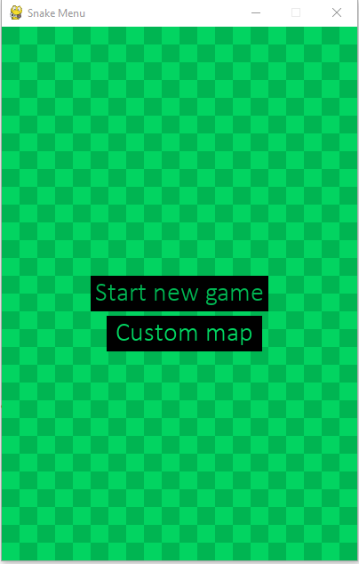
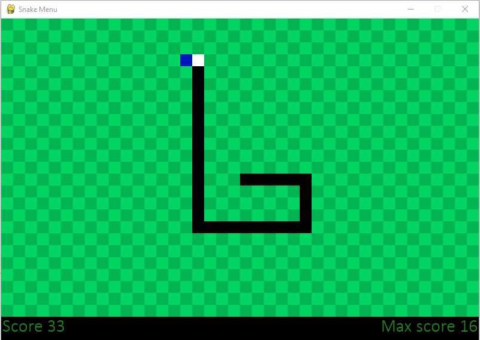
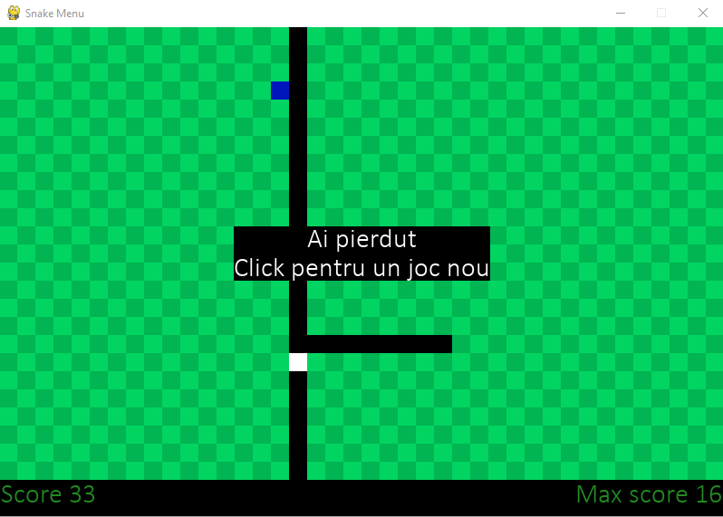
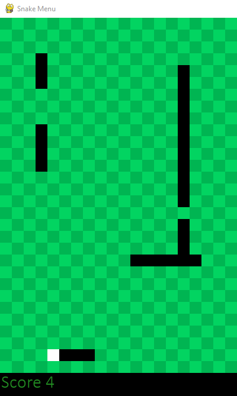

# Snake-python-2
Numele proiectului: Snake
id:19
## Cerinta
`Se va crea o interfață grafică minimală ce va oferi utilizatorului posibilitatea de a juca
Snake. Când script-ul se rulează, începe o sesiune de joc. O sesiune de joc va fi
formată din mai multe partide de joc.
După fiecare partidă de joc, se va afișa scorul obținut, cu posibilitatea de continuare sau
încheiere a sesiunii.
De asemenea, se va reține și cel mai mare scor, ce se actualizează, după caz, pe
parcursul sesiunii de joc. La încheierea sesiunii, recordul va fi afișat.
Se vor seta atat dimensiunea tablei cat și eventuale obstacole care pot exista pe tabla
(printr-un fișier JSON dat la intrare)`

In acest joc se poate juca standard sau dupa preferintele utilizatorului.
Acesta poatea sa modifice urmatoarele:
- Dimensiunea joculul. (zoom)
- Dimensiunea tabelei de joc
- Viteza cu care se misca sarpele
- Sa seteze obstacolele 

## Screenshots

